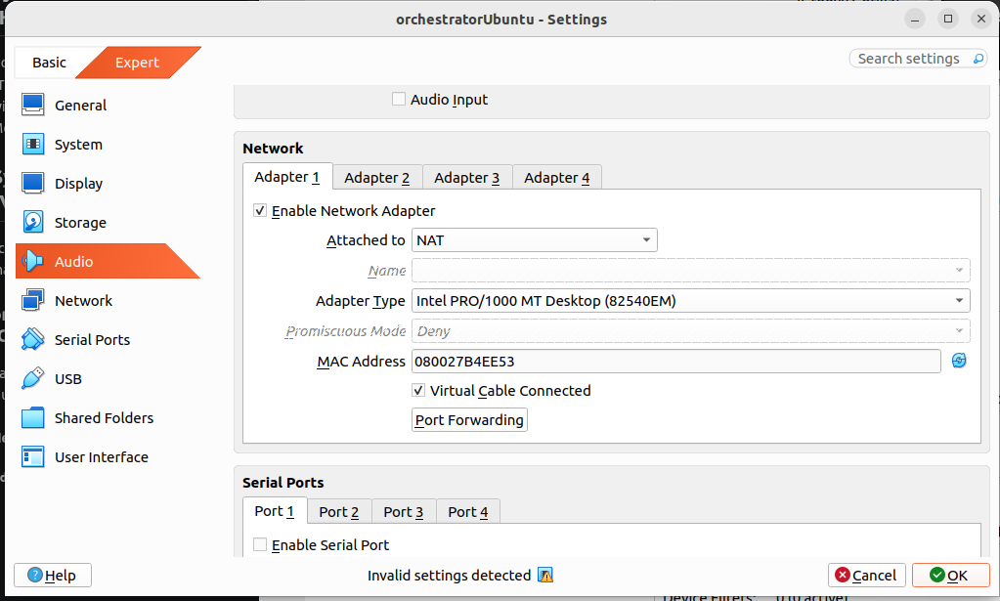
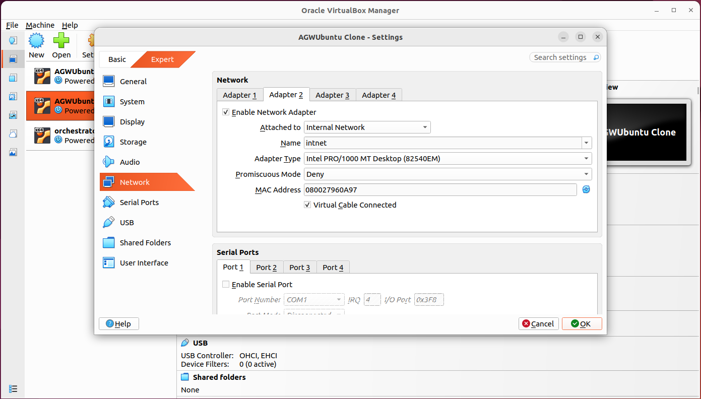
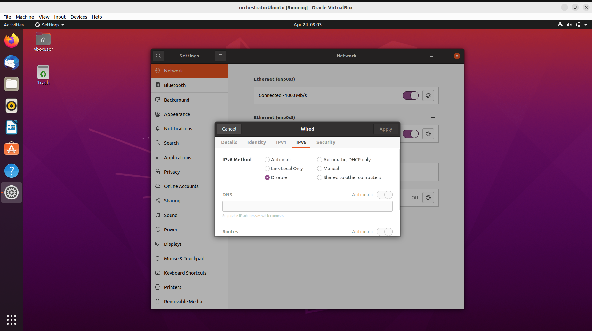
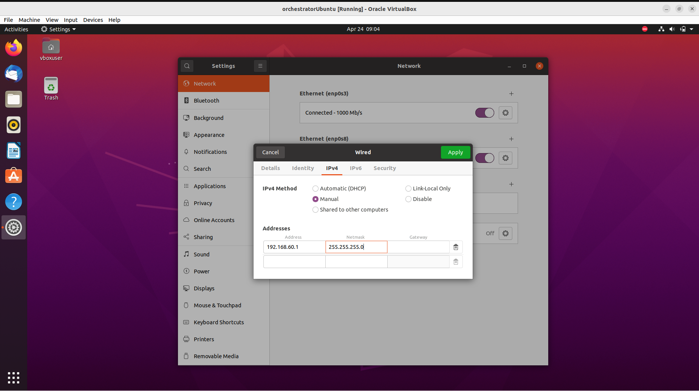
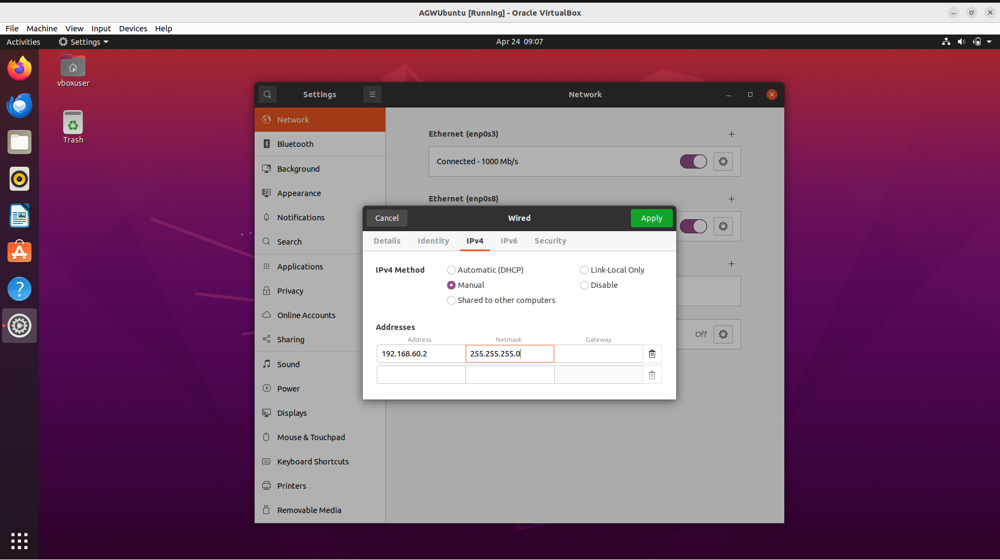
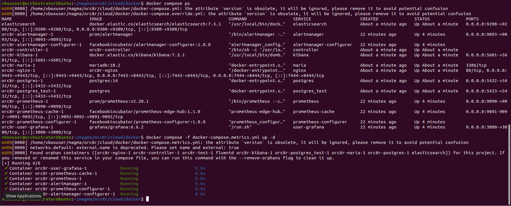
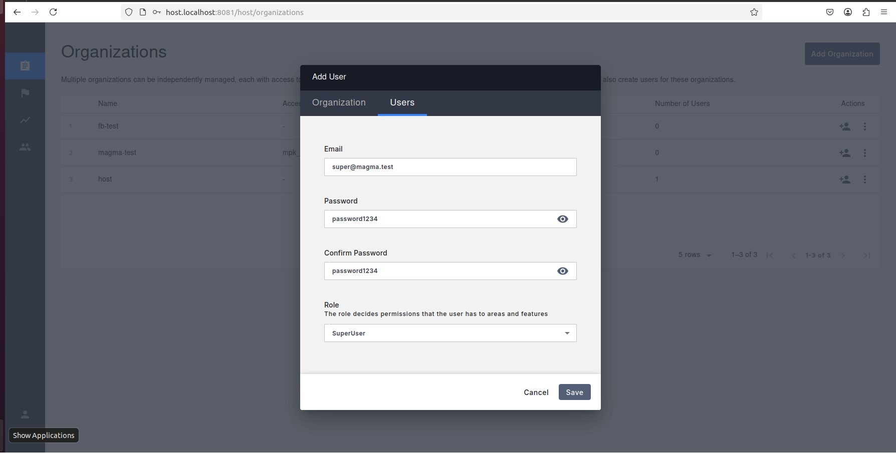
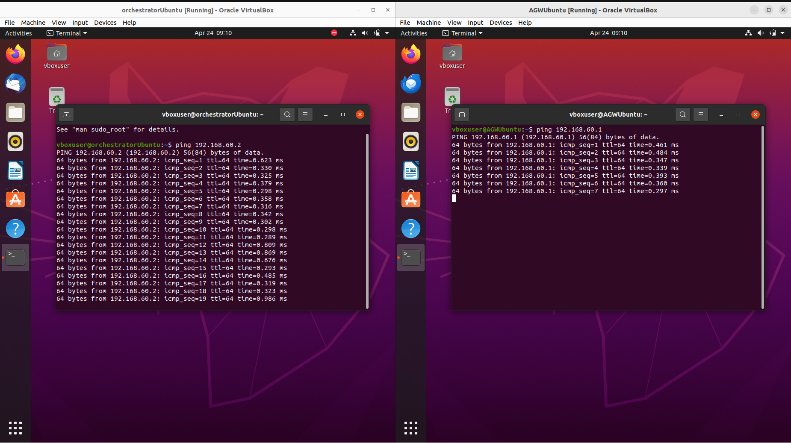
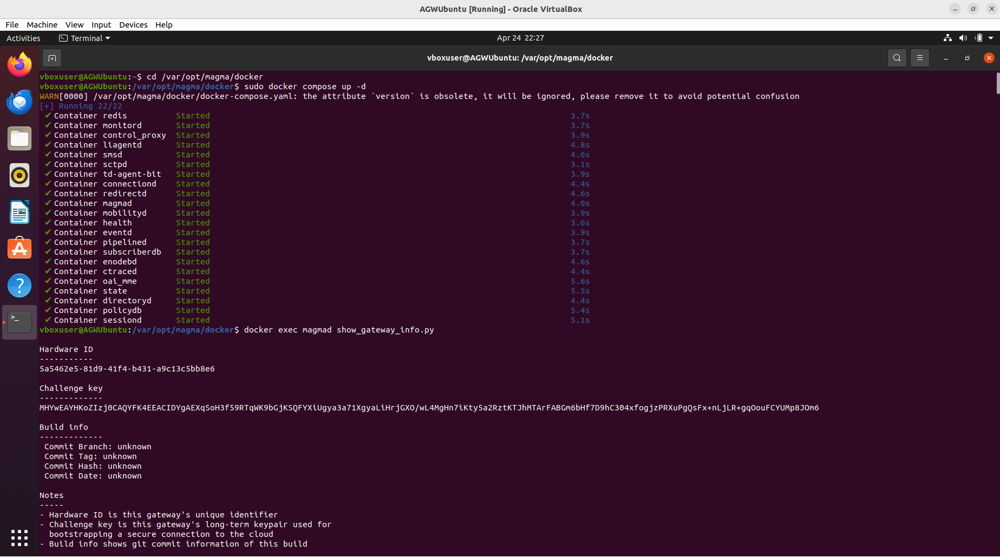
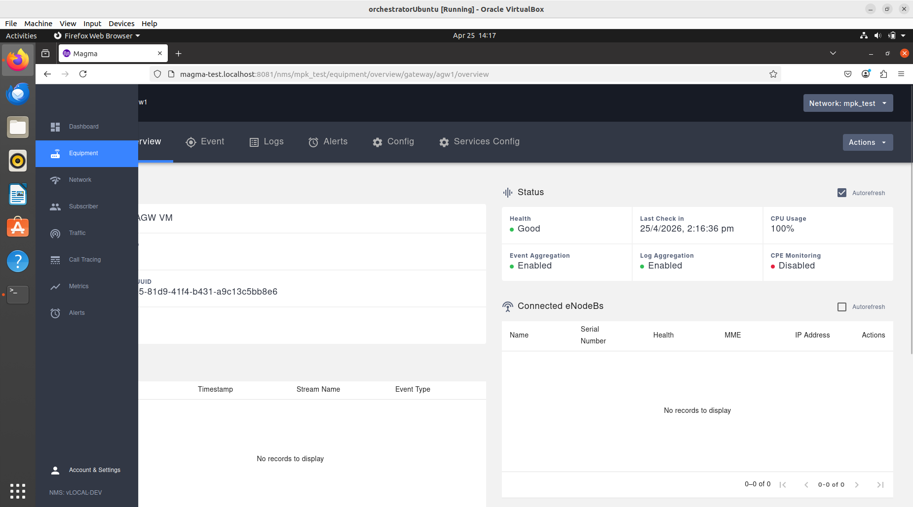

# Magma-deployment-documented


## index

 ## 1. [srsRAN](./srsRAN.md)
 ## 2. [UERANSIM](./ueransim.md)
 ## 3.[script explained](./scriptexplained.md)


## System information (Host OS)

Host OS Name - Ubuntu 22.04 LTS\
Host OS type - 64 bit\
Host windowing - wayland\
Host Memory - 16GiB

## System information (VMs)

I created 4 VMs (virtual machines)

### 1. orchestratorUbuntu -(Guestedition)
OS - Ubuntu 20.04.6\
base memoery - 6232 MB\
CPU Number - 2\
Processing cap - 50%\
storage - 50GB\
IPV6 disalbed\
IPV4 DHCP disabled and manual IP has been used\
#### Networking setup

#####  Adapter 1 



#####  Adapter 2


### 2. AGWUbuntu -(Guestedition)
OS - Ubuntu 20.04.6\
base memoery - 5000 MB but during sysren setup I had to decrease it to 2096 to save resources\
CPU Number - 2\
Processing cap - 50%\
storage - 50GB\
IPV6 disalbed\
IPV4 DHCP disabled and manual IP has been used 
#### Networking setup

#####  Adapter 1 


#### Adapter 2



### 3. UERANSIM5GUbuntu -(Guestedition)
OS - Ubuntu 20.04.6\
base memoery - 5000 MB\
CPU Number - 2 \
Processing cap - 50%\ 
storage - 50GB \
#### Networking setup

#####  Adapter 1 


### 4. srsRAN -(Guestedition)
OS - Ubuntu 20.04.6\
base memoery - 2096 MB\
CPU Number - 2\
Processing cap - 50%\
storage - 50GB
#### Networking setup

#####  Adapter 1 


#### Adapter 2


## Magma Deployment procedure 

### step 1 (orc8r)
I got started by installing prerequisites on the **orchestratorUbuntu -(Guestedition)** as desribed earlier from the official magma documentation from here 👇:-
[Magma prerequisites for Ubuntu](https://magma.github.io/magma/docs/basics/prerequisites#ubuntu)

then modified the networking settings:-



followed by Gateway and static IP address settings,saved:-




the prequisite log is here :- [text](./orc8rsetupflow.md)


then I changed the IP address to manual,DHCP disabled since, I was using wi-fi I had setup my VMs accordingly:-




followed by:-

[Beginner-friendly Git and Docker workflow for contributing to Magma NMS](https://medium.com/@pauloskidus48/a-beginner-friendly-git-and-docker-workflow-for-contributing-to-magmas-nms-fba541eb8443)

since my docker compose version was v2 , I used these modified commands instead:-
```
docker compose up -d
```
```
docker compose ps
```
```
docker compose -f docker-compose.metrics.yml up -d
```


#### NMS UI built showing both frontend as well as backend services started on docker


#### NMS UI docker services




#### Magma-test organization created
 


#### Super User created in Magma-test org
 


#### Magma-test org information
 


 


#### whole log is given here [click](./orc8rsetupflow.md)

### step 2 (AGW)

I got started by installing prerequisites on the **AGWUbuntu -(Guestedition)** as desribed earlier from the official magma documentation from here 👇:-
[Magma prerequisites for Ubuntu](https://magma.github.io/magma/docs/basics/prerequisites#ubuntu)

I followed the official AGW Docker deployment guide along with some important modifications specific to my setup:

* [Magma AGW Docker Deployment Guide](https://magma.github.io/magma/docs/lte/deploy_install_docker?utm_source=chatgpt.com)


---

#### Copying the Root CA

The documentation refers to a `rootCA.pem` file, which I found on my Orc8r host at:

```
magma/.cache/test_certs/rootCA.pem
```

I copied this file to my AGW VM at the following location:

```
/var/opt/magma/certs/rootCA.pem
```

---

#### Configuring Hostname Resolution

Instead of immediately creating `control_proxy.yml` as suggested in the official documentation, I first configured hostname resolution on the AGW VM.

I edited the `/etc/hosts` file:

```bash
nano /etc/hosts
```

Then I added the following entries, replacing `<orc8r_ip>` with the actual IP address of my Orc8r VM:

```
192.168.60.1  controller.magma.test
192.168.60.1  bootstrapper-controller.magma.test
```

---

#### Creating control_proxy.yml

After setting up hostname resolution, I proceeded to create and edit the `control_proxy.yml` configuration file:

```bash
nano /var/opt/magma/configs/control_proxy.yml
```

I added the following configuration:

```yaml
cloud_address: controller.magma.test
cloud_port: 7443

bootstrap_address: bootstrapper-controller.magma.test
bootstrap_port: 7444

fluentd_address: controller.magma.test
fluentd_port: 24224

rootca_cert: /var/opt/magma/certs/rootCA.pem
```

This configuration ensured that my AGW could properly communicate with Orc8r using the correct domains, ports, and certificates.

then I ran the ping test on both VMs to check the communication between, orc8r and AGW:

### ping test (successful)




## bash script (agw_install_docker.sh) modification ⚠

I modified the original AGW Docker install script because the original version was too rigid for my lab environment.

The main issues were:

it assumed the user was always ubuntu\
it installed old docker-compose\
it assumed legacy Compose v1 instead of Docker Compose v2\
it changed networking automatically\
it assumed interfaces were named eth0 and eth1\
it could interfere with VirtualBox networking\
it did not properly reconcile generated Magma configs with real interface names\
it did not protect against unsupported kernel versions\
it could continue even when important configs were missing or incomplete

My newer script is designed for my Docker Compose v2-based Magma AGW VM setup.\

-New script [click here](./MagmaDeploy/magma-scriptv2/agw_install_docker_compose_v2.sh)\
-New script explanation is here [click](./scriptexplained.md)


#### Hardware IDs & challenge key (after new bash script is successful)



Now I got Hardware ID and Challenge key and added AGW in my orc8r
during creation of gateway in the NMS UI 

then restarted my gateway



## AGW logs:-

[checkin log](./MagmaDeploy/AGWMagma/magma-mentorshipAGW/agw_logs/checkin.txt) \
[control proxy log](./MagmaDeploy/AGWMagma/magma-mentorshipAGW/agw_logs/control_proxy_logs.txt) \
[docker log](./MagmaDeploy/AGWMagma/magma-mentorshipAGW/agw_logs/docker_ps.txt) \
[gateway log](./MagmaDeploy/AGWMagma/magma-mentorshipAGW/agw_logs/gateway_info.txt)  
[magmad logs](./MagmaDeploy/AGWMagma/magma-mentorshipAGW/agw_logs/magmad_logs.txt) \
[ping controller log](./MagmaDeploy/AGWMagma/magma-mentorshipAGW/system_logs/ping_controller.txt)
