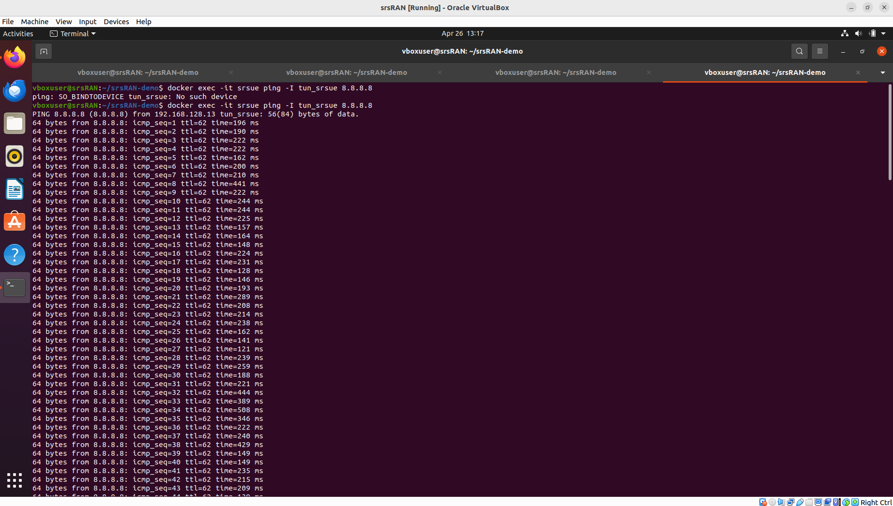
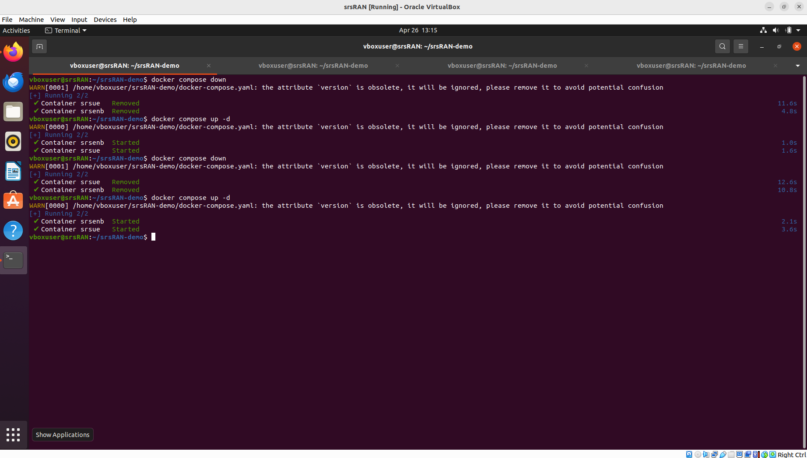
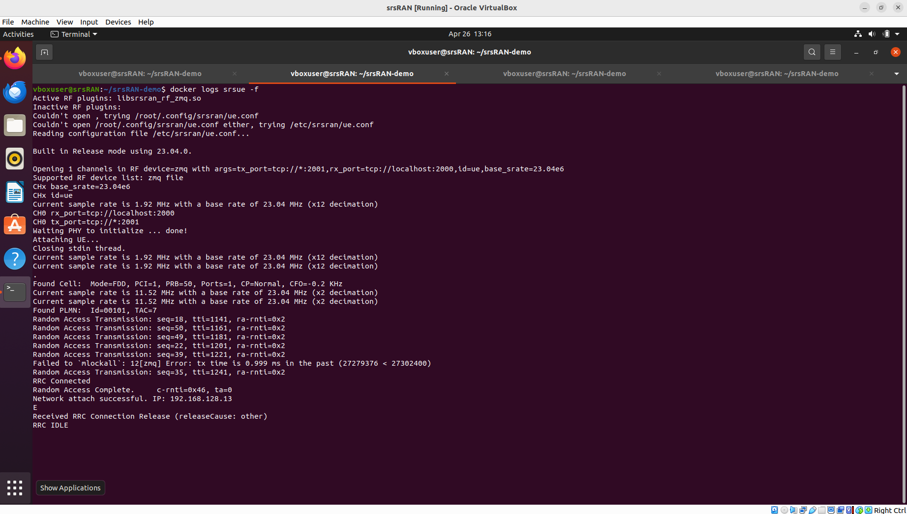
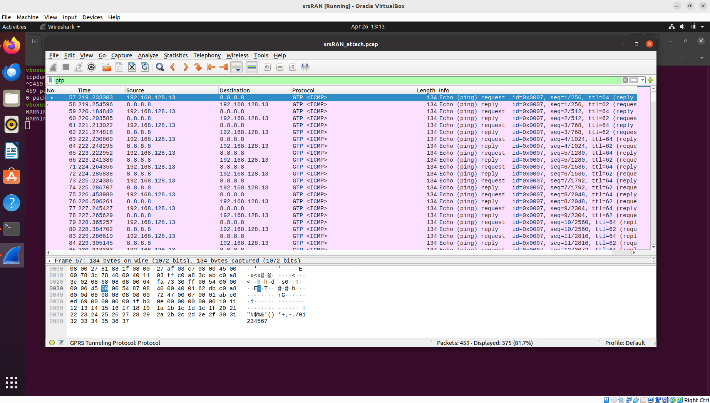
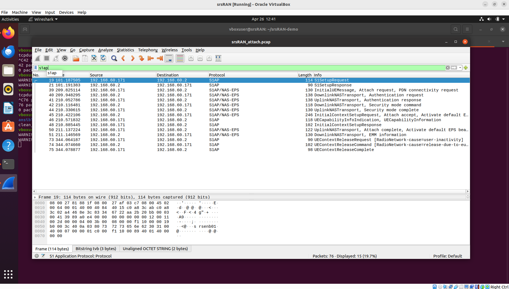
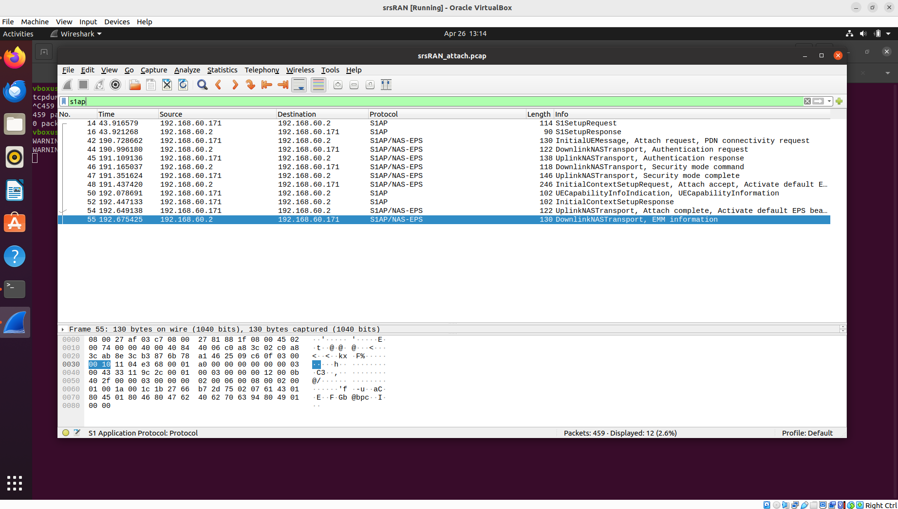
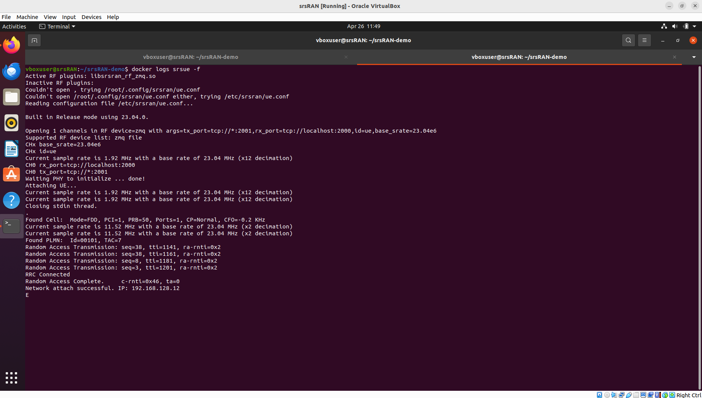
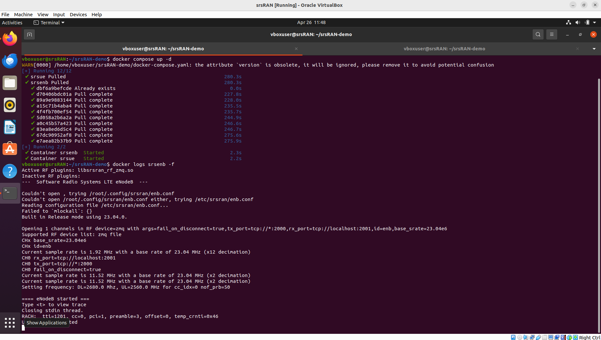

# srsRAN Deployment
## Overview

I deployed and tested srsRAN in my existing Magma-based LTE setup to understand the complete attach procedure and verify both control-plane and data-plane functionality. observed and validated the LTE signaling and traffic flow using packet captures.

---

## What I Did

### 1. Setting up srsRAN

I created a separate VM for srsRAN  whose configuration is explained here [click](./README.md) and connected it to the same internal network as the AGW. I configured the correct IP addresses:

- AGW (MME): `192.168.60.2`
- srsRAN (eNodeB): `192.168.60.171`




I modified the `docker-compose.yaml` to ensure:

- `mme_addr` pointed to the AGW
- `gtp_bind_addr` and `s1c_bind_addr` used the srsRAN VM IP

Then I started srsRAN using:

```bash
docker compose up -d
````

* * *

### 2. Verifying UE Attach

I monitored the UE logs:

```Bash
docker logs srsue -f
```

I observed:

* RRC connection establishment
* Authentication procedure
* Final attach success with IP allocation



This confirmed that the UE successfully attached and received an IP like `192.168.128.x`.

* * *

### 3. Packet Capture using tcpdump

To analyze the attach process, I captured packets on the AGW interface:

```Bash
sudo tcpdump -i enp0s8 -w srsRAN_attach.pcap
```

I made sure to:

* start capture before restarting srsRAN
* wait for "attach successful"
* keep the capture running a few seconds after attach
* then stop tcpdump

* * *

### 4. Analyzing the Capture in Wireshark

I opened the `.pcap` file in Wireshark and applied filters like:

```
s1ap
gtp
```

* * *

## What I Observed

### Control Plane (S1AP / NAS)

From the capture


, I observed the complete LTE attach sequence:

* SCTP handshake (INIT, ACK, COOKIE)
* `S1SetupRequest` and `S1SetupResponse`
* `InitialUEMessage` (Attach Request)
* Authentication Request/Response
* Security Mode Command/Complete
* `Attach Accept`
* `Attach Complete`

This confirmed that the UE successfully registered with the core network.

* * *

### Data Plane (GTP)

After attach, I generated traffic using:

```Bash
docker exec -it srsue ping 8.8.8.8
```

In the capture, I observed:

```
192.168.128.13 → 8.8.8.8  GTP <ICMP> Echo request
8.8.8.8 → 192.168.128.13  GTP <ICMP> Echo reply
```

This showed that:

* UE traffic was encapsulated in GTP
* Packets were tunneled over UDP (port 2152)
* Internet connectivity was working through the LTE data path


 



 


* * *

## Problems I Faced and How I Fixed Them

### 1. Wrong IP Configuration

Initially, I used incorrect IPs for the MME and srsRAN interfaces, which caused connection failures.

**Fix:**  
I verified AGW interfaces using `ip addr` and updated the configuration accordingly.

* * *

### 2. No GTP Traffic in Capture

At first, I only saw control-plane packets and no GTP traffic.

**Reason:**  
I was not generating traffic during capture.

**Fix:**  
I ran `ping 8.8.8.8` while tcpdump was still running.

* * *

### 3. Capture Timing Issues

I initially captured incomplete or irrelevant packets.

**Reason:**

* Started capture too late
* Stopped too early

**Fix:**  
I followed the correct sequence:

* Start tcpdump first
* Restart srsRAN
* Wait for attach
* Generate traffic
* Stop capture after delay

* * *

### 4. Misleading Ping Results

Ping to `8.8.8.8` worked even before I saw GTP traffic.

**Reason:**  
Traffic was going through the default NAT interface instead of the LTE tunnel.

**Fix:**  
I ensured traffic flowed through `tun_srsue` and verified GTP packets in Wireshark.

* * *

## Final Understanding

From this process, I understood that:

* **S1AP/NAS (control plane)** handles attach, authentication, and session setup
* **GTP (data plane)** carries actual user traffic
* UE traffic is encapsulated inside GTP and transported between eNodeB and core network
* Successful attach alone does not guarantee data flow; GTP validation is necessary

* * *

## Conclusion

I successfully:

* Deployed srsRAN with Magma AGW
* Completed LTE attach procedure
* Captured and analyzed control-plane signaling
* Verified data-plane traffic using GTP
* Confirmed end-to-end connectivity from UE to internet
