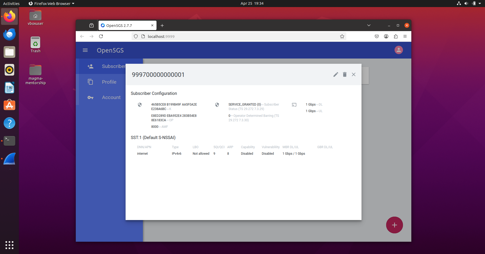
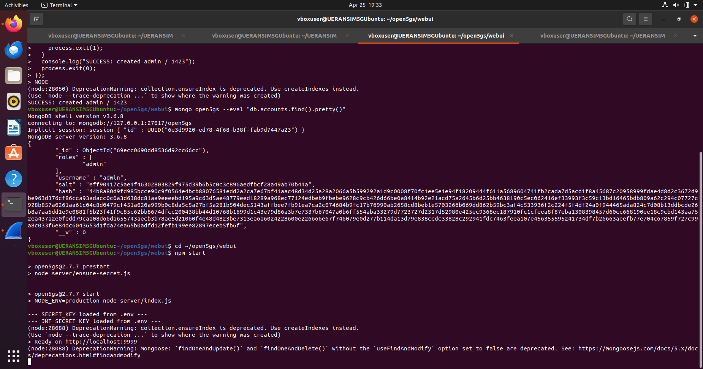
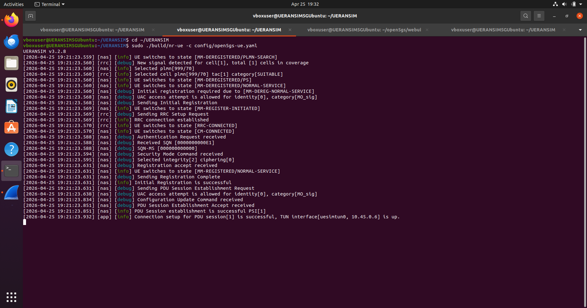
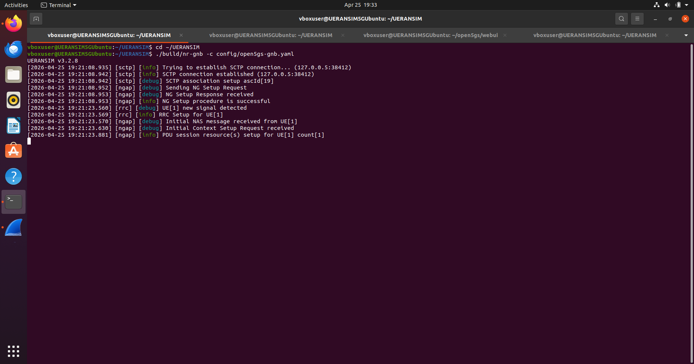
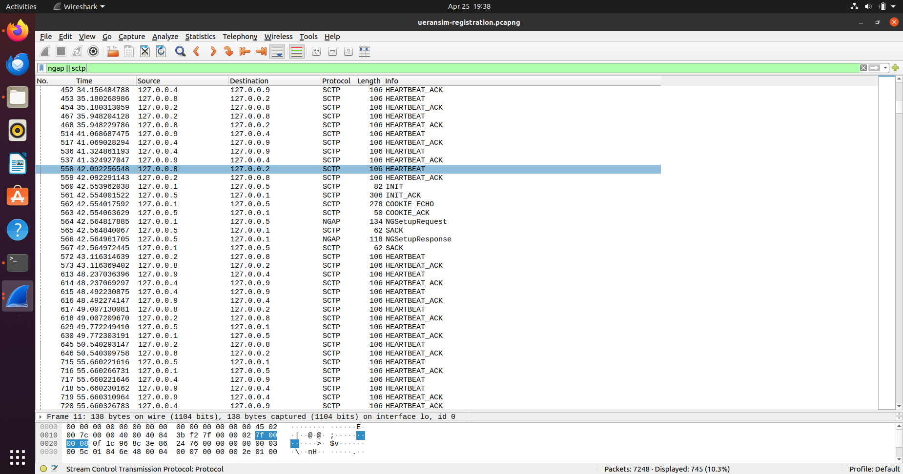

#  UERANSIM + Open5GS 5G Registration Flow Lab Report

---

## 1. Objective

The objective of this lab was to set up a standalone 5G testing environment using Open5GS and UERANSIM, and to perform and analyze a simulated 5G UE registration flow.

This lab was performed separately from the Magma AGW deployment because the current Magma AGW setup is LTE/4G-oriented, while UERANSIM is a 5G UE and gNB simulator.

### Goals

- Understand UE → gNB → Core communication  
- Analyze 5G registration flow  
- Study authentication and security setup  
- Establish a PDU session  
- Capture signaling traffic using Wireshark  

---

## 2. Lab Architecture

### VM Used

```bash
UERANSIM5GUbuntu
```
the setup for which has been explained here [click](./README.md)

### Architecture Diagram

> **UERANSIM5G Ubuntu VM**
> `UE` → `gNB` → `Open5GS 5G Core` → `AMF / SMF / UPF`

### Components

| Component    | Role                          |
|--------------|-------------------------------|
| Open5GS      | 5G Core network               |
| UERANSIM gNB | Simulated base station        |
| UERANSIM UE  | Simulated user equipment      |
| Wireshark    | Packet capture & analysis     |

---

## 3. Key Concepts

### UE (User Equipment)
represents a mobile device (phone/modem). Simulated using UERANSIM.

### gNB (Next Generation NodeB)
5G base station responsible for radio communication.

### AMF (Access and Mobility Management Function)
handles:
- registration
- authentication
- mobility

### SMF (Session Management Function)
handles:
- PDU session creation
- IP allocation

### UPF (User Plane Function)
handles:
- data traffic forwarding

### PDU Session
equivalent to a data session in 5G. assigns an IP address to UE.

---

## 4. Network Configuration

```bash
ip a
```

Example:

```
lo       127.0.0.1
enp0s3   10.0.2.15
ogstun   10.45.0.1
```

| Interface | Purpose |
|----------|--------|
| lo       | Local communication |
| enp0s3   | Internet (NAT) |
| ogstun   | UE tunnel |

---

## 5. Installing UERANSIM

```bash
git clone https://github.com/aligungr/UERANSIM
cd UERANSIM
make
```

### Error Encountered

```
cmake: not found
```

### Fix

```bash
sudo apt update
sudo apt install -y cmake
```

---

## 6. CMake Version Issue

### Error

```
CMake 3.17+ required
```

### Fix

```bash
sudo apt remove cmake -y
sudo snap install cmake --classic

make clean
make
```

---

## 7. Installing Open5GS

```bash
sudo apt update
sudo apt install -y gnupg curl software-properties-common
sudo add-apt-repository ppa:open5gs/latest
sudo apt update
sudo apt install -y open5gs
```

### Verify Services

```bash
systemctl status open5gs-amfd
systemctl status open5gs-smfd
systemctl status open5gs-upfd
```

---

## 8. Installing Open5GS WebUI

```bash
curl -fsSL https://deb.nodesource.com/setup_18.x | sudo -E bash -
sudo apt install -y nodejs

git clone https://github.com/open5gs/open5gs
cd open5gs/webui
npm install
```

### Build Error

```
No .next build found
```

### Fix

```bash
npm run build
npm start
```

Access UI:

```
http://localhost:9999
```

---

## 9. WebUI Login Issue

Default credentials:

```
admin / 1423
```

the password and username was incorrect so I tried to create them manually through monogodb terminal, which was not successful, so I followed this step instead and let it create the password and salt automatically


### Fix

```bash
mongo open5gs --eval "db.accounts.deleteMany({})"
```

---

## 10. gNB Configuration

```yaml
mcc: '999'
mnc: '70'
tac: 1

linkIp: 127.0.0.1
ngapIp: 127.0.0.1
gtpIp: 127.0.0.1

amfConfigs:
  - address: 127.0.0.5
    port: 38412

slices:
  - sst: 1
```

---

## 11. UE Configuration

```yaml
supi: 'imsi-999700000000001'
mcc: '999'
mnc: '70'

key: '465B5CE8B199B49FAA5F0A2EE238A6BC'
op: 'E8ED289DEBA952E4283B54E88E6183CA'
amf: '8000'
```

---

## 12. Running the Test

### Start Wireshark

```bash
wireshark
```

Filter:

```
ngap || sctp
```

### Start gNB

```bash
./build/nr-gnb -c config/open5gs-gnb.yaml
```

### Start UE

```bash
sudo ./build/nr-ue -c config/open5gs-ue.yaml
```

---

## 13. Output

```
Registration accept received
Initial Registration is successful
PDU Session establishment is successful
TUN interface [uesimtun0, 10.45.0.6] is up
```

---

## 14. 5G Registration Sequence Diagram

```
    1. Initial Registration
    2. Initial UE Message
    3.Authentication Request
    4.Authentication Response
    5.Security Mode Command
    6.Security Mode Complete
    7.Registration Accept
    8.Registration Complete
    9.PDU Session Request
    10.Session Create
    11.Configure
    12.Session Accept
```

---

## 15. Final Result

```
UE IP: 10.45.0.6
Registration: SUCCESS
PDU Session: SUCCESS
```

---

## 16. Key Learnings

- Successfully executed full 5G registration flow  
- Authentication depends on IMSI, Key, and OP values  
- Wireshark captures NGAP and SCTP signaling  
- Open5GS + UERANSIM enables full 5G simulation  

---

## 17. Conclusion

This lab successfully demonstrated a complete 5G registration and session establishment using UERANSIM on a separate VM.

---

## UE terminal

 


## gnb terminal



## user Registration packet capture using Wireshak

 


#### log data is given here :- 

[gnb log click here](./magma-mentorship-UERANSIM/gnb-log.txt) \
[ue log click here](./magma-mentorship-UERANSIM/ue-log.txt) \
[wireshak packet capture file](./magma-mentorship-UERANSIM/ueransim-registration.pcapng)
